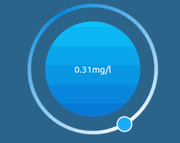

# CircularProgessPanel
这是一个基于Qt widget开发的圆形进度面板组件，采用2D绘图(QPainter)的方式绘制。目前该组件风格样式基本是定死在内部代码中的，所以并不适合作为一个基类使用，但可以作为一个圆形进度面板的代码设计参考。
## 示例

## 功能概述
该类继承自QWidget，重新实现paintevent()用来绘制整个界面。在PC上效果流畅度都还不错，但在我们的Arm板子(性能较低，无GPU)上，当该界面动态刷新时就需要占用较多的cpu去绘图，动态刷新间隔越短或者paintEvent()内部处理越复杂，cpu占用率就越高。虽然该类内将固定不变的背景图提前绘制到了pixmap上，降低了一定的cpu占用，但还是需要注意不要将刷新间隔设置的过短，另外可以适当调整角度增量宏OUTER_CIRCLE_ANGLE_INCREMENT，从视觉上提高刷新速度。  
## 版本控制
###V0.1：
该版本在初始化时将外圆(包括小圆)和内圆都画在了QPixmap上，在paintevent()中直接调用drawPixmap()绘制图片。在绘制外圆背景图前，通过对QPainter进行坐标系转换，进而实现小圆的转动效果。  
```
	//绘制外圆背景图(坐标系变换，旋转外圆环) cpu占用相对较高
    painter.save();
    //使用平滑的像素映射转换算法
    painter.setRenderHints(QPainter::SmoothPixmapTransform);
    painter.translate(circleCenter);
    painter.rotate(-smallCircleCurrentAngle);
    painter.translate(-circleCenter);
    painter.drawPixmap(this->rect(),outerCirclePixmap);
    painter.restore();
```

## 作者联系方式:
**邮箱:justdoit_mqr@163.com**  
**新浪微博:@为-何-而来**  